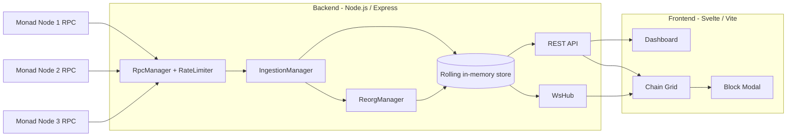

<p align="center">
  
</p>

<h1 align="center">Moyaki Trace Engine</h1>

<p align="center">
Web-based multi-node blockchain indexing engine for Monad mainnet with reorg detection, rate-limit resilience, and real-time execution trace streaming.
</p>

---

## Overview

Moyaki Trace Engine is a blockchain ingestion and trace-streaming project for Monad RPC endpoints.

It ingests blocks from multiple nodes, detects consensus divergence, handles reorg rollbacks, extracts execution traces, and streams normalized data to a live dashboard.

The backend keeps its working state and historical window in memory, so it does not require a third-party database to run.

---

## What This Demonstrates

- Distributed systems thinking
- Multi-node ingestion with consensus comparison
- Reorg-aware rollback and recovery logic
- Queue-based backpressure control
- Per-node rate limiting with retry/backoff
- Real-time WebSocket streaming architecture
- Rolling in-memory block and transaction state
- Modular backend system design

---

## Architecture



### Runtime Flow

1. The backend connects to the configured Monad RPC nodes.
2. `RpcManager` applies per-node rate limiting and retry logic.
3. `IngestionManager` processes blocks, traces, and reorg-aware updates.
4. The in-memory store keeps a rolling block window for API reads and history backfill.
5. The REST API serves block and network snapshots from retained state.
6. The WebSocket hub streams canonical block updates to the frontend.

---

## Backend Design Highlights

### RpcManager

* Per-node token-bucket rate limiting
* Exponential backoff for RPC rate-limit errors (`-32005`)
* Temporary node disablement on repeated failures
* Multi-node health tracking

### IngestionManager

* Per-node block queues
* Global trace processing queue
* Concurrency-limited workers
* In-memory normalized block + transaction store
* Indexed transaction lookup by hash
* Network consensus state snapshotting

### ReorgManager

* Rolling history window per node
* Parent-hash validation
* Automatic rollback callbacks on divergence
* Re-index support for corrected chain segments

### Rolling In-Memory Store

* Keeps a rolling window of canonical blocks in memory
* Supports rollback pruning on reorg events
* Serves the `/api/blocks/history` endpoint from retained history
* Requires no external database service at runtime

---

## API

### Health & Metrics

* `GET /health`
* `GET /metrics`

### Blocks

* `GET /api/blocks`
* `GET /api/blocks/latest`
* `GET /api/blocks/:hash`
* `GET /api/blocks/history`

Query parameters:

* `nodeId`
* `status`
* `fromHeight`
* `toHeight`
* `fromTs`
* `toTs`
* `limit`

### Transactions

* `GET /api/transactions/:txHash`

### Network State

* `GET /api/nodes`
* `GET /api/network/overview`

### WebSocket

Endpoint:

```text
ws://localhost:8080/ws
```

Events:

```json
{ "type": "ready" }
{ "type": "blocks", "data": [...] }
```

---

## Frontend Features

* Live multi-node block timeline
* Chain head agreement/divergence visualization
* Pause/resume stream control
* Backfill on reconnect
* Per-node lag and queue depth display
* Modal block + transaction details
* Trace summary inspection

---

## Quick Start

```bash
npm install
npm run dev
```

Services:

* Backend -> [http://localhost:8080](http://localhost:8080)
* Frontend -> [http://localhost:5173](http://localhost:5173)

Note:

* The frontend now defaults to `http://localhost:8080` and `ws://localhost:8080`.
* Copy `backend/sample.env` to `backend/.env` and set your Monad RPC URLs before starting the backend.
* Copy `frontend/sample.env` to `frontend/.env` if you want to override the local API or WebSocket URLs.

This starts both workspaces:

* Backend: `npm run dev -w backend`
* Frontend: `npm run dev -w frontend`

What to expect:

* Backend serves the API on `http://localhost:8080`
* Frontend serves the UI on `http://localhost:5173`
* The backend keeps its current window in memory, so restarting it clears the retained block history
* The frontend points at the local backend by default unless you change it

---


## Render Deployment (Backend)

If you deploy only the backend on Render, use these settings:

- **Root Directory:** `backend`
- **Build Command:** `pnpm install`
- **Start Command:** `npm start`

Important: `npm build` is not a valid npm command. If you need to run a build script, use `npm run build`.

## Local Testing

There is no dedicated automated test suite in the repo yet, so the recommended local validation is a smoke test:

1. Install dependencies with `npm install` from the repo root.
2. Start both apps with `npm run dev`.
3. Open `http://localhost:5173` in a browser and confirm the dashboard loads.
4. Check the backend health endpoint:

```bash
curl http://localhost:8080/health
```

5. Check the metrics endpoint:

```bash
curl http://localhost:8080/metrics
```

6. Optionally verify data endpoints:

```bash
curl http://localhost:8080/api/nodes
curl http://localhost:8080/api/blocks/latest
```

7. If the Monad RPC endpoints are reachable, you should see live block activity and websocket updates in the frontend.

Backend checks:

```bash
npm run check -w backend
```

Frontend build check:

```bash
npm run build
```

Notes:

* The project does not require a third-party database to start locally.
* The live indexing data depends on external Monad RPC availability, so the UI can still load even if the chain data is sparse or delayed.
* If one RPC node is unreachable, set the corresponding `MONAD_NODE*` environment variable to a working endpoint.

### Troubleshooting

* If you see `ENOTFOUND` for `node3.monad.xyz`, set `MONAD_NODE3` to a working WebSocket RPC endpoint.
* To use your own endpoints, edit `backend/.env` after copying from `backend/sample.env`.
* If the frontend cannot reach the backend, confirm `frontend/.env` points to the same host and port as the backend.

---

## Environment Variables (Backend)

| Variable | Default | Description |
| --- | --- | --- |
| `WS_PATH` | `/ws` | WebSocket endpoint path |
| `POLL_INTERVAL_MS` | `3000` | Poll cadence for HTTP RPC nodes |
| `METRICS_LOG_INTERVAL_MS` | `60000` | Interval for logging metrics snapshots |
| `BROADCAST_WINDOW_MS` | `60000` | Window used when broadcasting live updates |
| `MAX_IN_MEMORY_BLOCKS` | `5000` | Retained in-memory block window |
| `LAST_BLOCKS_WINDOW` | `20` | Rolling rollback history per node |
| `MAX_BATCH_SIZE` | `20` | RPC batch size ceiling |
| `PER_NODE_BLOCK_CONCURRENCY` | `5` | Block-processing workers per node |
| `TRACE_CONCURRENCY` | `10` | Global trace extraction worker count |
| `MAX_QUEUE_SIZE` | `1000` | Max queued block or trace tasks |
| `MAX_REQUESTS_PER_SECOND_PER_NODE` | `40` | Per-node RPC request budget |

---

## Design Notes

The project prioritizes:

* Reliability over raw throughput
* Observability over abstraction
* Explicit concurrency control
* Failure-aware ingestion
* Clear separation of concerns

It is intentionally structured to reflect backend infrastructure engineering patterns rather than demo-level blockchain tooling.

---

## Potential Future Enhancements

* Integration tests with mocked RPC reorg scenarios
* Persistent metrics to time-series storage
* Authentication + API rate limiting
* Dockerized deployment
* Horizontal ingestion scaling

---

## License

MIT
