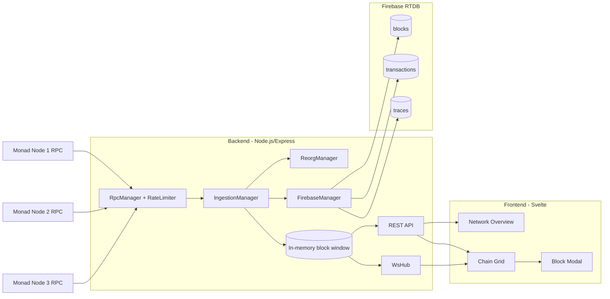

<p align="center">
  
</p>

<h1 align="center">MonadTraceEngine</h1>
<p align="center">
Production-style Monad indexing project focused on backend reliability, multi-node consistency checks, and real-time trace visualization.
</p>


## Why this project

This repo is designed to demonstrate engineering quality for backend-heavy blockchain infrastructure work:

- resilient ingestion from multiple RPC nodes
- queue-based backpressure and retry handling
- reorg detection with rollback support
- trace enrichment (`debug_traceTransaction`) for transaction execution insights
- real-time UI for chain heads, lag, and block stream state

## Architecture



## Backend highlights

- `RpcManager`:
  - per-node token-bucket rate limiting
  - retry/backoff for rate-limit errors (`-32005`)
  - temporary node disablement on repeated limit failures
- `IngestionManager`:
  - per-node block queues + global trace queue
  - normalized block/tx storage in memory
  - indexed tx lookup by hash
  - node runtime health snapshots and network consensus overview
- `ReorgManager`:
  - recent history window per node
  - rollback callbacks for divergent chain segments
- `FirebaseManager`:
  - atomic multi-path writes for blocks/transactions/traces
  - RTDB-safe sanitization for keys and values

## API

### Health and metrics

- `GET /health`
- `GET /metrics`

### Blocks and transactions

- `GET /api/blocks?nodeId=&status=&fromHeight=&toHeight=&fromTs=&toTs=&limit=`
- `GET /api/blocks/latest`
- `GET /api/blocks/:hash`
- `GET /api/transactions/:txHash`

### Network and node status

- `GET /api/nodes`
- `GET /api/network/overview`

### WebSocket

- endpoint: `ws://localhost:4000/ws` (configurable via `WS_PATH`)
- events:
  - `{"type":"ready"}`
  - `{"type":"blocks","data":[...]}`

## Frontend highlights

- live timeline grid for per-node block flow
- pause/resume stream control
- reconnect with backfill
- network overview panel for:
  - chain head agreement/divergence
  - highest seen/indexed blocks
  - per-node lag, queue state, and health
- modal details for transactions and trace summaries

## Quick start

```bash
npm install
npm run dev
```

Services:

- backend: `http://localhost:4000`
- frontend: `http://localhost:5173`

## Environment variables (backend)

| Variable | Default | Description |
|---|---|---|
| `PORT` | `4000` | Backend HTTP port |
| `WS_PATH` | `/ws` | WebSocket endpoint path |
| `POLL_INTERVAL_MS` | `3000` | Poll cadence for HTTP RPC nodes |
| `PER_NODE_BLOCK_CONCURRENCY` | `5` | Block-processing workers per node |
| `TRACE_CONCURRENCY` | `10` | Global trace extraction worker count |
| `MAX_QUEUE_SIZE` | `1000` | Max queued block or trace tasks |
| `MAX_IN_MEMORY_BLOCKS` | `5000` | Retained block window in memory |
| `MAX_REQUESTS_PER_SECOND_PER_NODE` | `40` | Node-level RPC request budget |
| `SERVICE_ACCOUNT_JSON_PATH` | _none_ | Firebase service account path |
| `FIREBASE_DATABASE_URL` | _none_ | Firebase RTDB URL override |

## Suggested next improvements

- add integration tests with mocked RPC reorg scenarios
- persist node health metrics to time-series storage
- add auth/rate-limits for public API deployment
- containerize backend/frontend for reproducible environments
